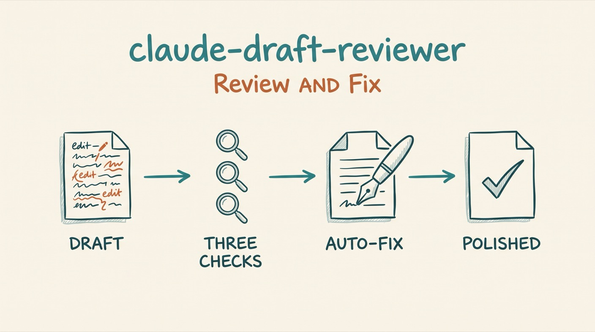

# Draft Reviewer

*Review AND FIX any draft for AI slop, writing craft, and voice consistency.*

 



A Claude Code agent that reviews AND FIXES drafts for AI slop, writing craft, and voice consistency. Unlike traditional reviewers that just report issues, this agent applies all fixes directly.

## Why

Content reviewers typically produce reports listing issues for you to fix. This creates:

- Manual work translating suggestions to edits
- Risk of missing items in the list
- Inconsistent application of fixes
- Extra round-trips between review and implementation

This agent eliminates that gap by being a **fixer, not just a reporter**.

## Install

```bash
# In Claude Code:
/plugin marketplace add aplaceforallmystuff/marketplace
/plugin install claude-draft-reviewer@aplaceforallmystuff
```

<details>
<summary>Manual install (without the marketplace)</summary>

```bash
# Clone the repository
git clone https://github.com/aplaceforallmystuff/claude-draft-reviewer.git

# Copy to your Claude Code agents directory
cp claude-draft-reviewer/agents/draft-reviewer.md ~/.claude/agents/
```
</details>

## Use cases

- Use it when a blog post or newsletter draft reads like generic AI output and you want the slop removed, not just flagged.
- Use it when you want craft fixes — weak openings, choppy fragments, passive voice, abstract adjectives — applied straight to the file.
- Use it when a draft must match a voice profile: supply a `VOICE.md` and the agent aligns the text to it.
- Use it when a first-person account (build log, incident report, project update) makes specific claims that need checking against source material before they ship.
- Use it when you say "review this draft", "check my writing", or "audit content".

## How it works

The agent runs a 3-phase workflow:

| Phase | Action | Output |
|-------|--------|--------|
| 1. Analysis | Runs three quality checks | Issues identified |
| 2. Apply Fixes | Uses Edit tool on each issue | Content modified |
| 3. Report | Summarizes changes made | Before/after log |

### Quality Checks

1. **Slop Detection** - Identifies AI-generated patterns (requires `slop-detector` skill)
2. **Craft Rules Audit** - Checks writing mechanics (requires `craft-rules` skill)
3. **Voice Check** - Validates voice consistency (requires `voice-editor` skill)
4. **Factual Accuracy** - Verifies claims in first-person/experiential content against source material

### What Gets Fixed Automatically

| Category | Examples |
|----------|----------|
| Tier 1 Slop | "delve", "landscape", "game-changer" |
| Tier 2 Slop | "leverage", "robust", "seamless" |
| Passive Voice | "was implemented" → "implemented" |
| Staccato Fragments | Short. Choppy. Sentences. → Combined |
| Weak Openings | Generic intros → Specific hooks |
| Abstract Adjectives | "innovative" → specific details |

### What Gets Flagged (Not Auto-Fixed)

- Tone choices that could go either way
- Major structural reorganization
- Content additions or deletions
- Anything that changes meaning
- Unverifiable factual claims in first-person content (removed or genericized rather than left in)

### Optional: Local LLM Cost Optimization

If you have a local LLM available (e.g., via Ollama), the agent can run a quick pre-scan to classify drafts by severity before running full analysis. This can reduce token costs by 40-50% for clean drafts. See the agent file's `<cost_optimization>` section for details.

## Example

Invoke the agent on a draft and it runs the checks, applies edits, then reports what changed:

```
User: @draft-reviewer review this blog post [paste content]

Agent: Running quality checks...

[Invokes slop-detector]
[Invokes craft-rules]
[Invokes voice-editor]

Applying fixes...

[Edit: "delve into" → "examine"]
[Edit: "In today's fast-paced world" → removed]
[Edit: passive voice → active voice]
```

Illustrative report the agent returns:

```
# Draft Review + Edit Report

## Quick Summary
- Slop Score:   45/100 → 12/100 after fixes
- Craft Score:  9/16   → 14/16 after fixes
- Voice Match:  70%    → 92%
- Edits Applied: 8 changes made

[detailed before/after log...]
```

## Configuration

This agent requires three companion skills to function:

- [`slop-detector`](https://github.com/aplaceforallmystuff/claude-slop-detector) - AI pattern detection
- [`craft-rules`](https://github.com/aplaceforallmystuff/claude-craft-rules) - Writing mechanics (if published)
- [`voice-editor`](https://github.com/aplaceforallmystuff/claude-voice-editor) - Voice consistency

Install the required skills before using this agent.

The agent uses the Sonnet model by default for a speed/quality balance, and needs these tools:

- `Read` - Read draft content
- `Write` - Create new files if needed
- `Edit` - Apply fixes
- `Skill` - Invoke quality check skills
- `Glob` - Find files

## Philosophy

> **Editors, not critics.**

Traditional review processes separate analysis from implementation. This agent merges them:

1. Find an issue
2. Fix it immediately
3. Report what changed

No suggestions. No recommendations. Just fixes with explanations.

## License

MIT — see [LICENSE](LICENSE).

---

**The goal: Clean drafts, not clean reports about dirty drafts.**
